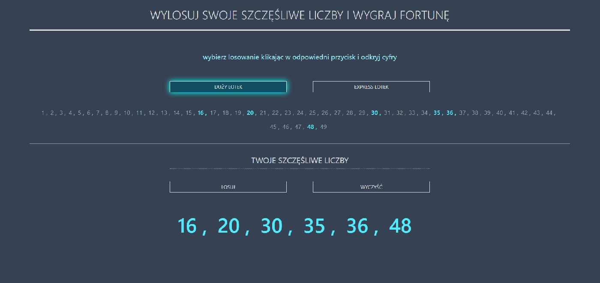

# React + TypeScript + Vite

## How to run

All commands are run from the root of the project, from a terminal:

| Command         | Action                                      |
| :-------------- | :------------------------------------------ |
| `npm install`   | Installs dependencies                       |
| `npm run dev`   | Starts local dev server at `localhost:5173` |
| `npm run build` | Build your production site to `./dist/`     |

# --------------------------------

# a mini application for drawing lottery numbers

## live:

https://random-lottto-numbers.vercel.app/



# --------------------------------

### The technology used is:

- React
- TypeScript
- Tailwind

```

```
